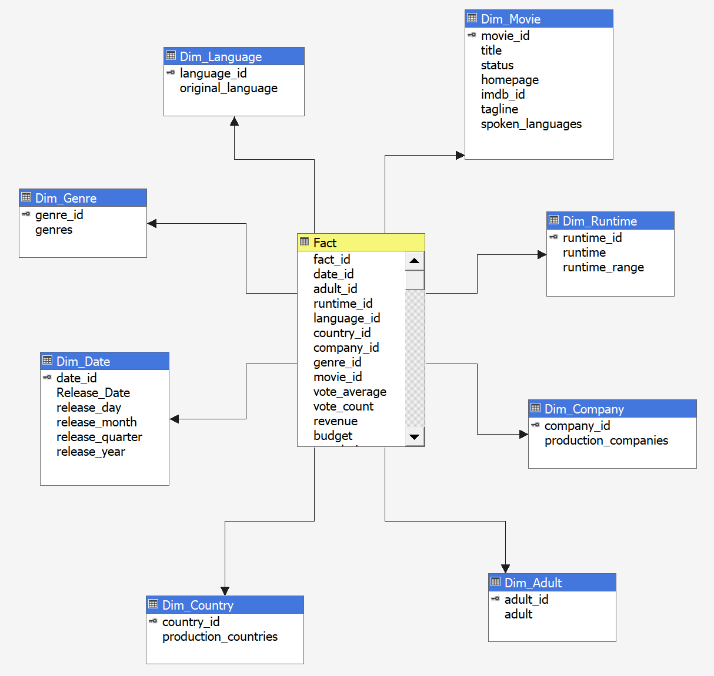
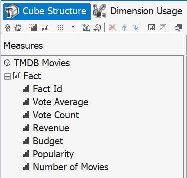
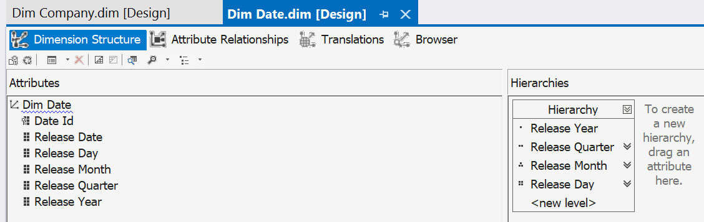
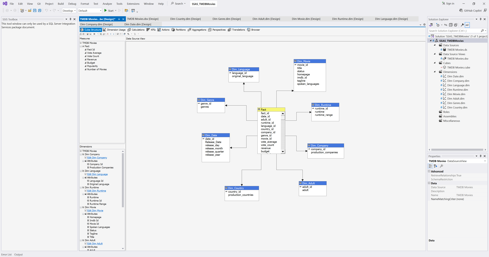
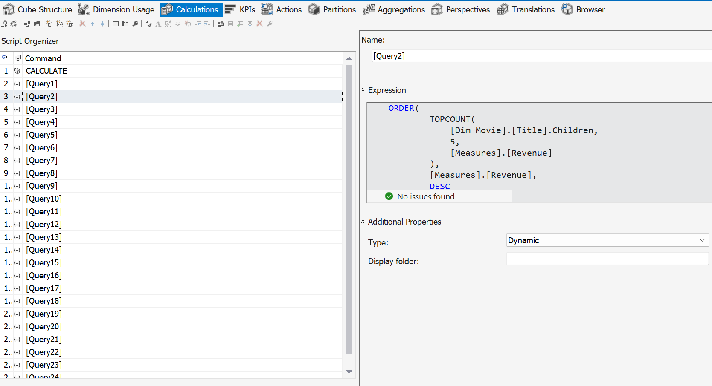

# 📦 SSAS - OLAP Cubes for TMDB Movies

## 📌 Overview
This folder contains the **SSAS (SQL Server Analysis Services)** project that builds the **OLAP cubes** for the TMDB Movies Data Warehouse.  
The cube allows **multidimensional analysis** of movie data across genres, companies, countries, and time dimensions, supporting advanced reporting and decision-making.

---

## 📂 Files
- **SSAS_TMDBMovies.sln** → SSAS solution file  
- **SSAS_TMDBMovies.dwproj** → Project configuration  
- **SSAS_TMDBMovies.database** → Deployment metadata  
- **Dim *.dim** → Dimension definitions (Movie, Genre, Company, Country, Language, Date, Runtime, Adult)  
- **TMDB Movies.cube** → Cube structure and measures  
- **TMDB Movies.ds** → Data source (SQL Server connection)  
- **TMDB Movies.dsv** → Data source view (tables and relationships)  
- **TMDB Movies.partitions** → Partition configuration for large datasets  

---

## ⭐ Cube Design

### Dimensions
- **DimMovie** → Movie details  
- **DimGenre** → Genre classification  
- **DimCompany** → Production studios  
- **DimCountry** → Country of production  
- **DimLanguage** → Original and spoken languages  
- **DimDate** → Release date hierarchy (Year → Quarter → Month → Day)  
- **DimRuntime** → Runtime categories  
- **DimAdult** → Movie adult rating  

### Measures
- **Revenue**  
- **Budget**  
- **Popularity**  
- **Vote Average**  
- **Vote Count**  
- **Runtime**  

---

## 📜 Example OLAP Analysis
- Revenue by **Genre** across different **Decades**  
- Average Rating by **Country of Production**  
- Popularity trends by **Release Year**  
- Comparison of **Budget vs. Revenue** per studio  
- Top 10 Studios ranked by **Total Revenue**  

---

## 📷 Screenshots

| Architecture | Diagram | Dimensions |
|--------------|---------|------------|
|  |  |  |

| Date Hierarchy | Overview | Query & Calculations |
|----------------|----------|-----------------------|
|  |  |  |

---

## 🚀 How to Run
1. Open **Visual Studio** with SQL Server Data Tools (SSDT).  
2. Load `SSAS_TMDBMovies.sln`.  
3. Configure the **Data Source (`TMDB Movies.ds`)** to point to your SQL Server warehouse.  
4. Deploy the project to your SSAS instance.  
5. Process the cube (`TMDB Movies.cube`).  
6. Query the cube using **MDX** or Excel PivotTables.  

---

## 📌 Example MDX Queries

```mdx
-- Top 5 Genres by Total Revenue
SELECT
  TOPCOUNT([DimGenre].[GenreName].Members, 5, [Measures].[Revenue]) ON ROWS,
  [Measures].[Revenue] ON COLUMNS
FROM [TMDB Movies];

-- Revenue Trend by Year
SELECT
  [DimDate].[Year].Members ON ROWS,
  [Measures].[Revenue] ON COLUMNS
FROM [TMDB Movies];

-- Compare Ratings: US vs Non-US Productions
SELECT
  {[DimCountry].[USA], [DimCountry].[Non-USA]} ON ROWS,
  [Measures].[Vote Average] ON COLUMNS
FROM [TMDB Movies];
