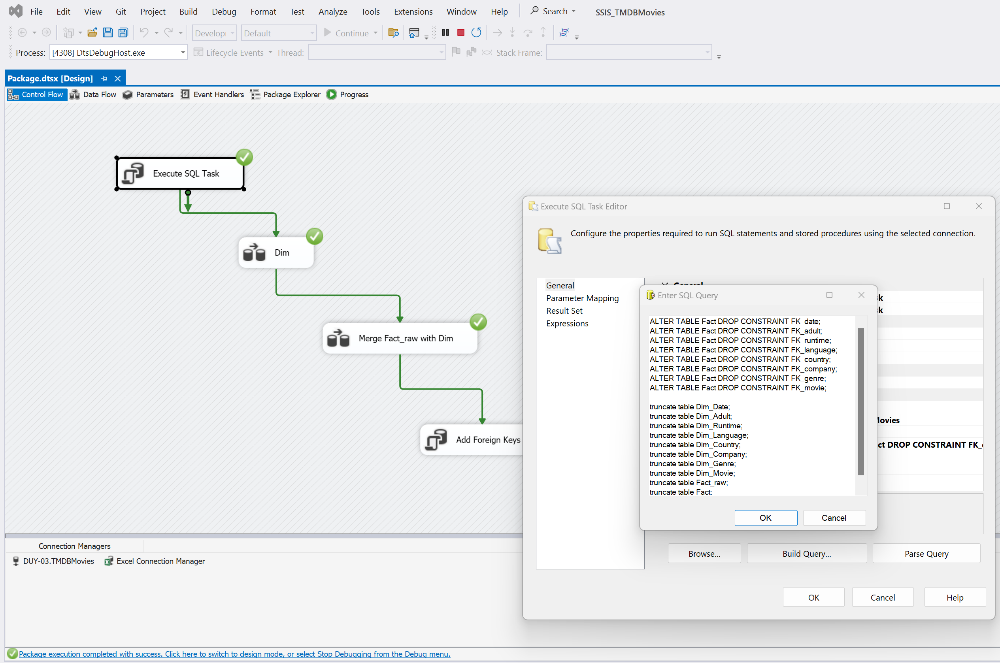
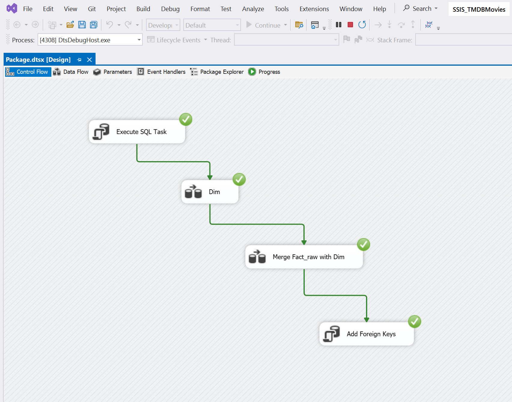
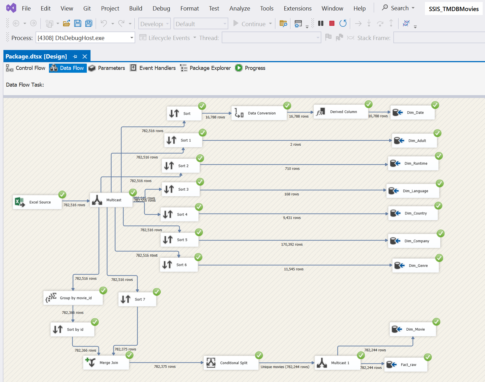
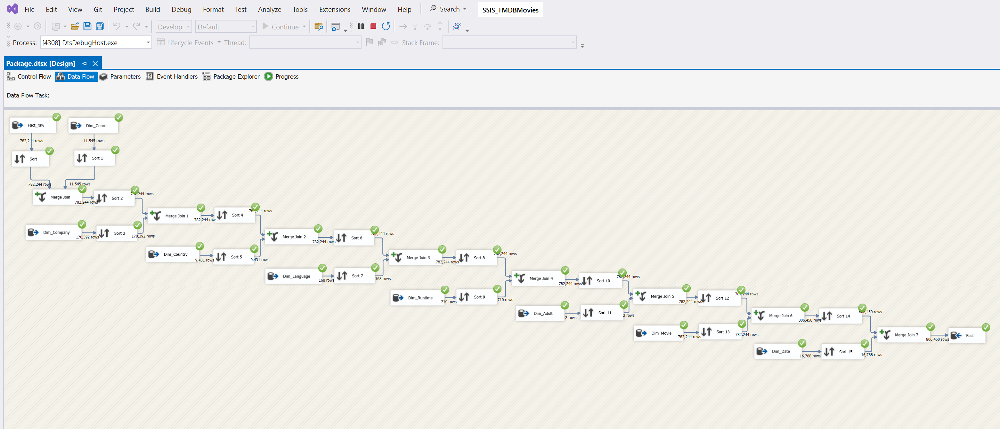
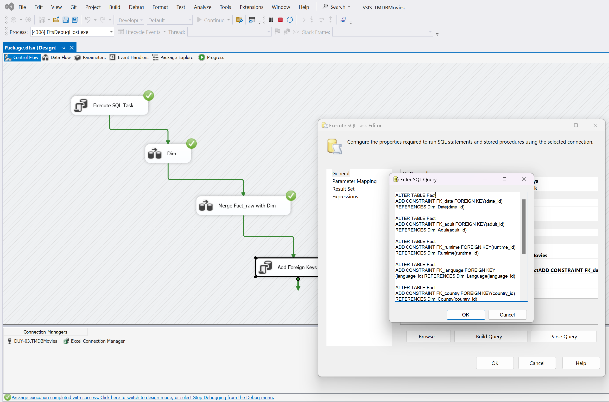

# 🔄 SSIS - ETL Pipeline for TMDB Movies

## 📌 Overview
This folder contains the **SSIS (SQL Server Integration Services)** project that manages the **ETL (Extract – Transform – Load)** process for the TMDB Movies Data Warehouse.  

The ETL workflow ensures that raw CSV/Excel data is properly cleaned, transformed, and loaded into the **star schema** in SQL Server for further OLAP analysis and reporting.

---

## 📂 Files
- **SSIS_TMDBMovies.sln** → SSIS solution file  
- **SSIS_TMDBMovies.dtproj** → SSIS project configuration  
- **Project.params** → Project parameters (connection strings, file paths)  
- **SSIS_TMDBMovies.database** → Deployment metadata  
- **README.md** → Documentation for ETL pipeline  

---

## ⭐ ETL Process

### 1. Extract
- Load raw data from CSV and Excel files:  
  - `movie_details.csv`  
  - `financial_data.csv`  
  - `ratings_popularity.csv`  
  - `production_info.csv`  
  - Others  

### 2. Transform
- Data cleaning and preprocessing:  
  - Handle missing values (budgets, runtimes, etc.)  
  - Standardize formats (dates, numeric values)  
  - Derived columns for business logic  
  - Lookup transformations for dimension keys  

### 3. Load
- Populate **dimension tables** (DimMovie, DimGenre, DimCompany, DimCountry, DimLanguage, DimDate, DimRuntime, DimAdult)  
- Populate **fact table** (FactMovies) with revenue, budget, ratings, and popularity  

---

## 📷 Screenshots

| Overview | Main Pipeline |
|----------|---------------|
|  |  |

| Data Flow 1 | Data Flow 2 | Control Flow |
|-------------|-------------|--------------|
|  |  |  |

---

## 🚀 How to Run
1. Open **Visual Studio** with SQL Server Data Tools (SSDT).  
2. Load `SSIS_TMDBMovies.sln`.  
3. Configure **Project.params** (update connection managers with your SQL Server instance).  
4. Run the **Control Flow** to execute the full ETL pipeline.  
5. Validate that dimension and fact tables in SQL Server are populated.  

---

## 📌 Example Transformations
- **Budget Correction** → Replace invalid values (< $10,000) with estimates  
- **Runtime Filtering** → Remove unrealistic runtimes (> 300 mins or < 50 mins)  
- **Genre Normalization** → Convert multiple genres into lookup IDs  
- **Date Dimension** → Map release dates into Year, Quarter, Month, Day  

---

## ✅ Key Outcomes
- Automated **data ingestion** from multiple sources  
- Standardized and cleaned datasets for warehouse integration  
- Successfully loaded data into **star schema**  
- Prepared data for OLAP cubes (SSAS) and reporting (SSRS/Power BI)  
