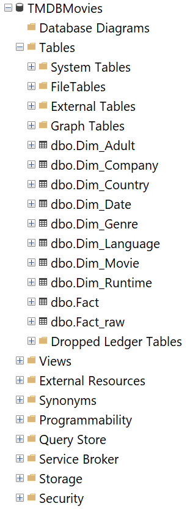
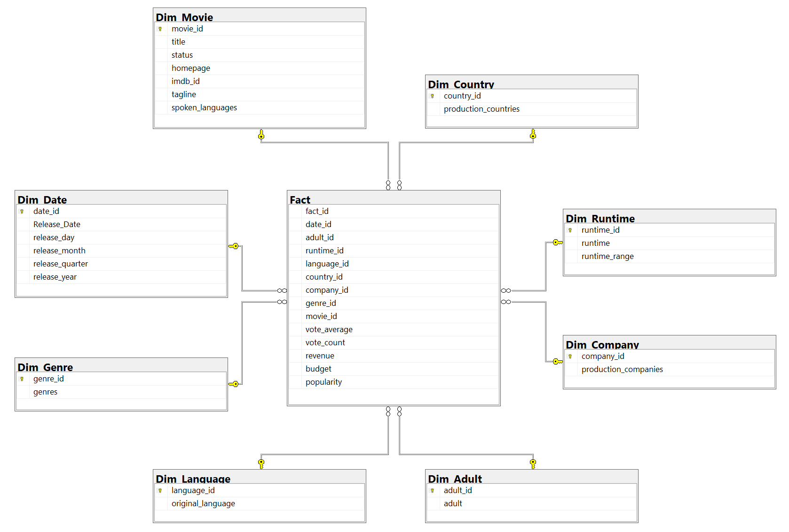
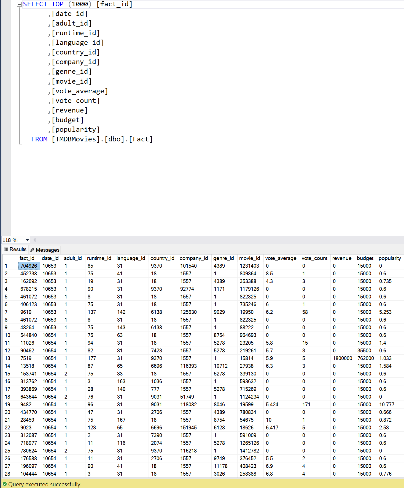

# 🗄️ SSMS - SQL Server Data Warehouse Schema

## 📌 Overview

This section documents the **SQL Server schema design** and queries for the TMDB Movies Data Warehouse.  
The design follows a **star schema** approach, where the **FactMovies** table stores measures (revenue, budget, ratings, popularity) and is connected to multiple **dimension tables**.

---

## 📂 Files

- **SQLQuery.sql** → Scripts for creating schema, dimensions, and fact table
- **SQLScript.txt** → Additional supporting SQL statements

---

## ⭐ Schema Design

**Fact Table**

- `FactMovies`
  - Measures: Revenue, Budget, Runtime, Popularity, Vote Average, Vote Count

**Dimension Tables**

- `DimMovie`
- `DimGenre`
- `DimCompany`
- `DimCountry`
- `DimLanguage`
- `DimDate`
- `DimRuntime`
- `DimAdult`

This schema enables **OLAP-style queries** with SSAS cubes and BI dashboards.

---

## 📷 Screenshots

| Architecture                                               | ERD Diagram                                      | Fact Table                                             |
| ---------------------------------------------------------- | ------------------------------------------------ | ------------------------------------------------------ |
|  |  |  |

---

## 🚀 How to Use

1. Open **SQL Server Management Studio (SSMS)**.
2. Connect to your SQL Server instance.
3. Run `SQLQuery.sql` to create the schema and tables.
4. Optionally, use `SQLScript.txt` for testing queries and loading data.
5. Verify schema design with the database diagram.

---

## 📌 Example Queries

```sql
-- Total Revenue by Genre
SELECT g.GenreName, SUM(f.Revenue) AS TotalRevenue
FROM FactMovies f
JOIN DimGenre g ON f.GenreID = g.GenreID
GROUP BY g.GenreName
ORDER BY TotalRevenue DESC;

-- Average Rating by Year
SELECT d.Year, AVG(f.VoteAverage) AS AvgRating
FROM FactMovies f
JOIN DimDate d ON f.DateID = d.DateID
GROUP BY d.Year
ORDER BY d.Year;
```
