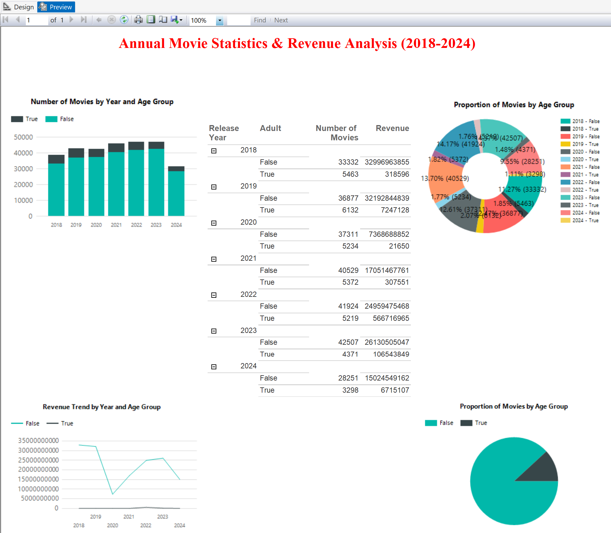
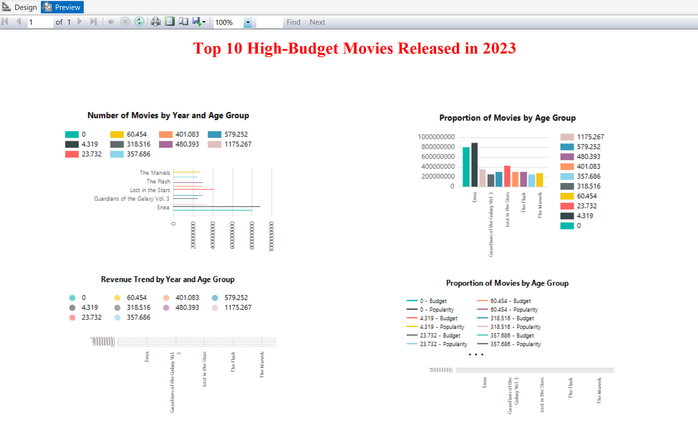
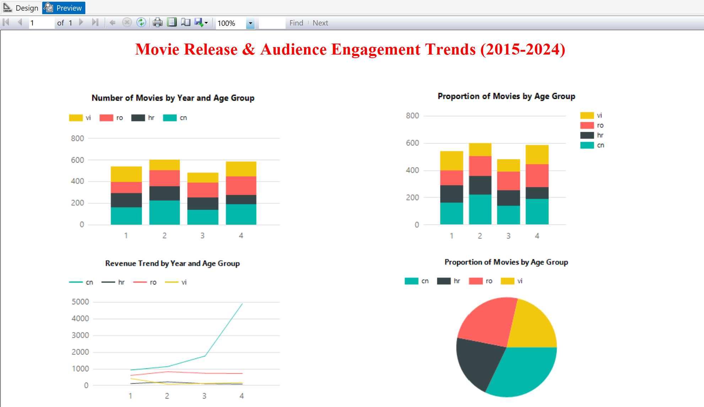

# 📑 SSRS - Reporting for TMDB Movies

## 📌 Overview
This folder contains the **SSRS (SQL Server Reporting Services)** project used to build reports and dashboards for the TMDB Movies Data Warehouse.  
The reports are connected to the **SSAS OLAP cube** and allow interactive analysis of movie revenue, ratings, popularity, and production performance.  

---

## 📂 Files
- **SSRS_TMDBMovies.sln** → SSRS solution file  
- **SSRS_TMDBMovies.rptproj** → Report project configuration  
- **SSRS_TMDBMovies.rptproj.rsuser** → User settings  
- **query3.rdl.data** → Report definition (sample 1)  
- **query12.rdl.data** → Report definition (sample 2)  
- **query13.rdl.data** → Report definition (sample 3)  

---

## ⭐ Key Reports
1. **Revenue Distribution Report**  
   - Shows revenue trends by **genre**, **year**, and **decade**  

2. **Top Studios Report**  
   - Highlights the highest-grossing **production companies**  

3. **Popularity & Ratings Report**  
   - Compares **vote averages**, **vote counts**, and **popularity scores** across dimensions  

---

## 📷 Screenshots

| Report 1 | Report 2 | Report 3 |
|----------|----------|----------|
|  |  |  |

---

## 🚀 How to Run
1. Open **Visual Studio** with SQL Server Data Tools (SSDT).  
2. Load `SSRS_TMDBMovies.sln`.  
3. Configure the data source to connect to your **SSAS cube**.  
4. Preview reports directly in Visual Studio, or deploy them to your **SSRS Report Server**.  
5. Access deployed reports via **Report Manager (Web portal)**.  

---

## 📌 Example Use Cases
- Which genres generated the highest revenue in the 2010s?  
- Which studios consistently deliver profitable movies?  
- How do ratings and popularity correlate with revenue over time?  

---

## ✅ Key Outcomes
- Built **3 professional reports** for data-driven movie analysis  
- Connected SSRS to **SSAS OLAP cube** for real-time queries  
- Enabled stakeholders to **explore insights visually** without writing queries  
